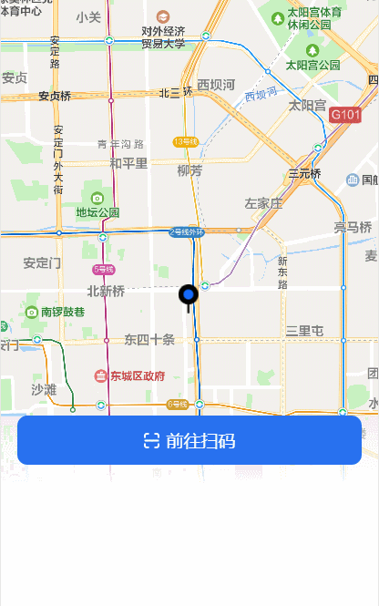
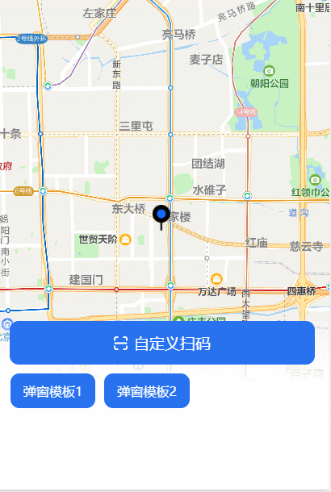
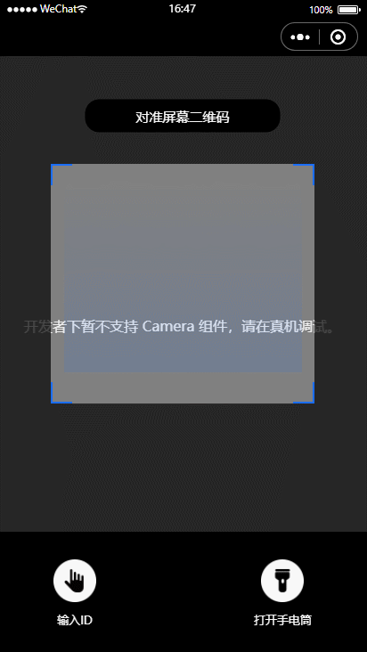

<div align="center">

  <h3><strong>微信小程序组件和功能封装</strong></h3>
  <div style="margin-top:10px;"><a href="javascript:;"></a>
  <a href="https://opensource.org/licenses/mit-license.php"></a></div>

  <h1></h1>
</div>

注意需要开启微信开发者工具中的 ES6 转 ES5 功能（部分功能用到async需要开启增强编译），将微信更新到最新版本。

## 项目预览

</img>
</img>
</img>

  <h1></h1>

## 主要内容

- [可触摸拖动菜单栏](#可触摸拖动菜单栏)
- [自定义扫码界面](#自定义扫码界面)
- [自定义全局弹窗组件](#dialog)

## 目录结构

请用微信开发者工具打开

```
├─img ---------- 公共图片
├─miniprogram_npm ---- npm包编译出的公共模块
│  └─eventemitter2 --- 事件通信
├─pages ----------- 页面目录
│  ├─index ----------- 首页
│  ├─cameraScan ------ 自定义扫码页
│  └─component ------- 公共组件页面
├─utils ----------- 工具目录
│  ├─global ----------- 公共配置
│  ├─touchmove -------- 触摸事件封装
│  └─util ------------- 工具函数
├─app.js
├─app.json
├─app.wxss
└─README.md
```

## Dialog

弹窗提示，对普遍在移动开发中使用的弹窗组件进行了封装

##### 属性

- `size` 弹窗大小（normal：正常，large:大，small：小）
- `type` 弹窗样式类型
- `title` 弹窗标题
- `content` 弹窗内容
- `contentposition` 弹窗内容位置（居左或居中）
- `status` 是否显示蒙版
- `marsktap` 蒙版是否支持点击事件
- `foot` 是否有点击按钮

##### 使用

```javascript
let option = {
  status: true, //启用蒙版
  closeicon: true, //启用右上角关闭按钮
  content: `维护中，暂不可提供服务`,
  foot: [
    {
      text: "我知道了",
      cb: () => {},
    },
    {
      text: "确定",
      cb: () => {},
    },
  ],
};
emitter.emit("dialogstatus", option);
return;
```

## 第三方UI库使用到

* eventemitter2（6.4.3） <https://www.npmjs.com/package/eventemitter2>

## License
[](https://opensource.org/licenses/mit-license.php) 
